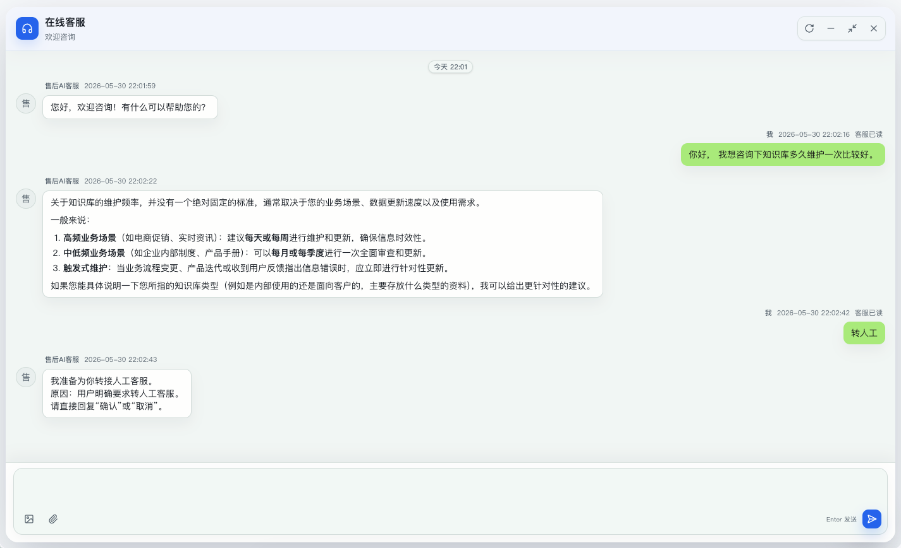
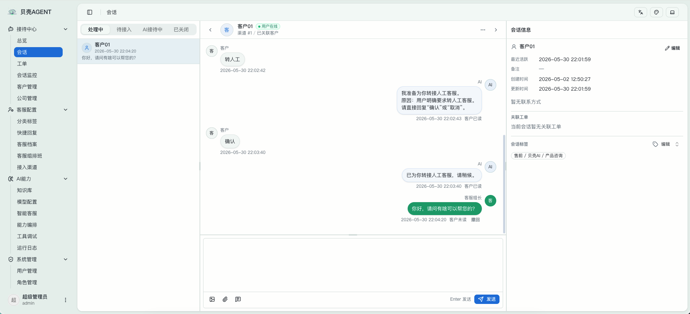
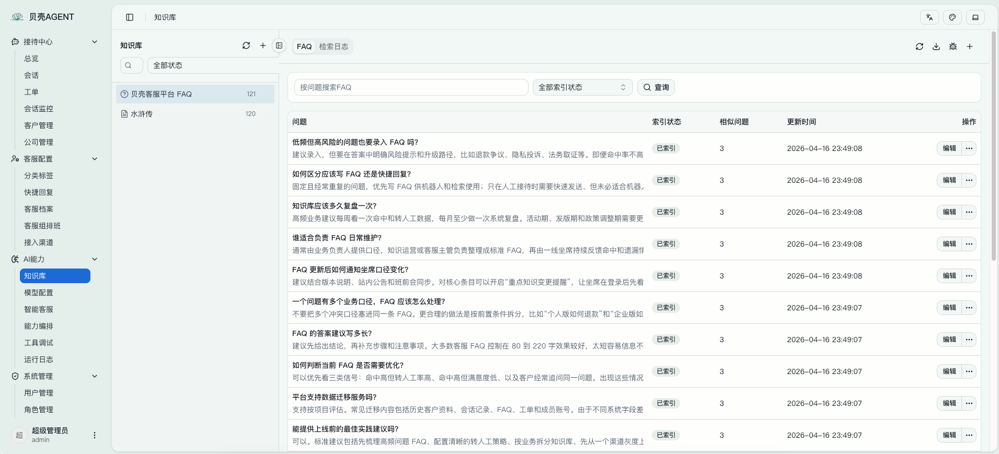
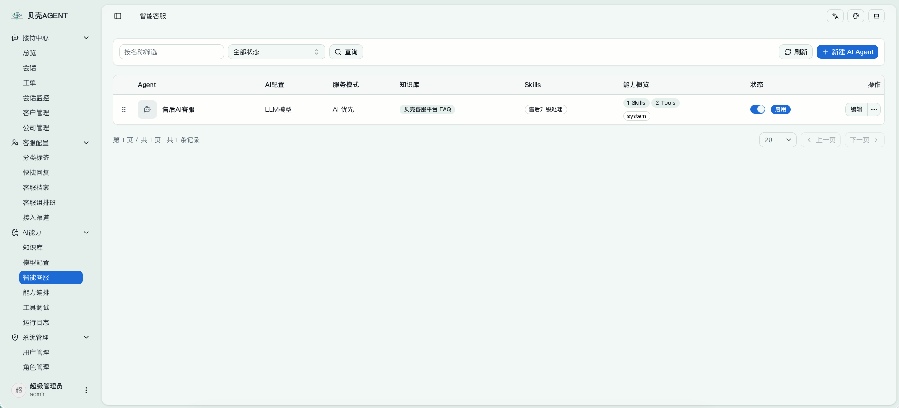
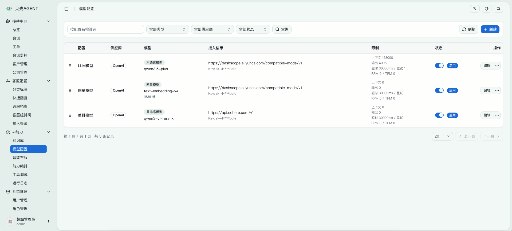
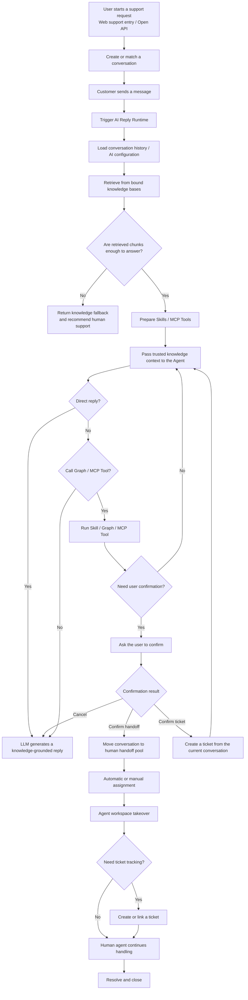
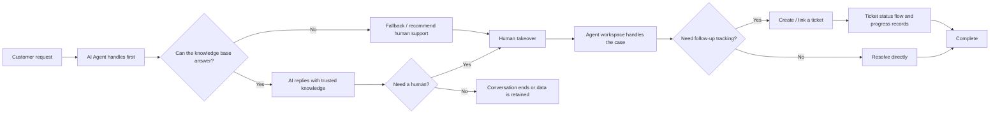

# AgentDesk

English | [简体中文](README_ZH.md)

An open-source AI Agent customer support system with knowledge-based answers, human handoff, ticket workflows, and self-hosted deployment.

> Built for teams that need online support, knowledge-base Q&A, human collaboration, and service tracking in one system. It is not just an LLM inside a chat box; it is an AI Helpdesk foundation designed around real support operations.

## Product Preview

Customer chat, agent workspace, knowledge base, model configuration, and AI Agent orchestration are managed in one system.

### Customer Chat



Customers can start a conversation from the web chat page. The AI Agent responds first with knowledge-grounded answers. When the user explicitly asks for a human, the system can start a handoff confirmation flow.

### Agent Workspace



The support workspace includes conversation lists, message handling, AI-to-human handoff, agent replies, conversation tags, linked customers, and ticket context for daily support work.

### Knowledge Base and AI Agent Configuration

| Knowledge Base FAQ | AI Agent Configuration |
| --- | --- |
|  |  |

The knowledge base stores FAQs, documents, and retrievable content. AI Agents can be bound to model configurations, knowledge bases, Skills, and tools to create support agents for specific scenarios.

### Model Configuration



Model configuration supports OpenAI-compatible providers. You can configure LLMs, embedding models, rerank models, context limits, output settings, timeout, retry behavior, and enablement state.

## Why Use It

- **AI-first support**: Let AI Agents handle common questions, standard procedures, and knowledge-base answers first.
- **Knowledge-constrained replies**: Use RAG and the Answerability Gate to decide whether retrieved knowledge is strong enough to answer, reducing unsupported responses.
- **Natural human handoff**: Move to human agents when knowledge is insufficient, the user asks for help, or a workflow requires human confirmation.
- **Conversation-to-ticket loop**: Online chat, support handling, ticket creation, status flow, and progress records stay in one system.
- **Built for extension**: The backend uses Go, the frontend uses Next.js, and the runtime supports Skills, MCP, and OpenAI-compatible model access.
- **Self-host friendly**: Supports SQLite / MySQL and Qdrant for local trials, intranet deployment, and enterprise self-hosting.

## Core Capabilities

- **AI Agent support**: AI replies first, with fallback, confirmation, tool calling, and human collaboration.
- **Online conversation system**: Visitor sessions, message send/receive, unread status, assignment, transfer, and close flows.
- **Agent workspace**: Agents can take over conversations, reply to users, transfer teammates, link customers, and create tickets.
- **Knowledge-base RAG**: Knowledge bases, documents, FAQs, chunking, vector retrieval, retrieval logs, and quality analysis.
- **Answerability Gate**: Checks whether retrieved content can support an answer; otherwise returns a fallback and recommends human support.
- **Ticket system**: Create tickets from conversations, categorize, assign, move through status flows, record progress, and close the loop.
- **Support organization management**: Agent profiles, teams, schedules, and automatic assignment.
- **AI extensibility**: Skills, MCP debugging, and external tool integration.
- **Multiple entry points**: Admin dashboard, agent workspace, customer-facing web pages, and embeddable SDK.

## Use Cases

- Website live support
- SaaS product support
- AI + human hybrid support
- Internal enterprise service desk
- After-sales service, incident reporting, complaints, and operations support
- Support teams that need knowledge-base Q&A with human collaboration

## Quick Start

The fastest way to try the full stack is Docker Compose:

```bash
docker compose up -d --build
```

For the full English setup guide, see [Docker Compose Quick Start](https://agent-desk.huabei.pro/docs/getting-started/docker-compose.html).

To embed customer support on your website, see [Web Widget Integration](https://agent-desk.huabei.pro/docs/integration/web-widget.html).

To connect OpenAI-compatible model providers, see [Model Provider Configuration](https://agent-desk.huabei.pro/docs/config/model-provider.html).

Compose starts:

- `agent-desk`: application service on port `8083`
- `mysql`: MySQL 8.4 with the `mysql-data` volume
- `qdrant`: vector database with the `qdrant-data` volume, ports `6333` / `6334`

After startup, open:

- Admin dashboard: `http://localhost:8083/dashboard`
- Agent workspace: `http://localhost:8083/dashboard/conversations`
- Customer web integration demo: `http://localhost:8083/support/demo`
- Customer chat page: `http://localhost:8083/support/chat`

Default administrator account:

- Username: `admin`
- Password: `ChangeMe123!`

> Before exposing the system to the public internet or a team environment, change the default administrator password and configure independent authentication, session, and model secrets.

## Local Development

### Requirements

- Go `1.26+`
- Node.js `20+`
- `pnpm`
- Qdrant

### Prepare Configuration

```bash
cp config/config.example.yaml config/config.yaml
```

The default configuration uses:

- SQLite: `data/app.db`
- Backend: `http://127.0.0.1:8083`
- Qdrant gRPC: `127.0.0.1:6334`

If Qdrant is not running locally, start it with Docker:

```bash
docker run -p 6333:6333 -p 6334:6334 qdrant/qdrant
```

Install frontend dependencies:

```bash
cd web
pnpm install
cd ..
```

Start backend and frontend development servers together:

```bash
make dev
```

Or start them separately:

```bash
make run-go
make web-dev
```

Default development URLs:

- Admin dashboard: `http://localhost:3000/dashboard`
- Agent workspace: `http://localhost:3000/dashboard/conversations`
- Customer web integration demo: `http://localhost:3000/support/demo`
- Customer chat page: `http://localhost:3000/support/chat`

## Tech Stack

- Backend: Golang + Gin + GORM + `github.com/mlogclub/simple`
- Frontend: Next.js 16 + React 19 + shadcn/ui + Tailwind CSS
- Database: SQLite / MySQL
- Vector DB: Qdrant
- AI: OpenAI-compatible LLM / Embedding + RAG + Skills + MCP

## Project Structure

```text
.
├── cmd/                    # server / migration / generator / testdata
├── internal/
│   ├── bootstrap/          # startup, routes, database, and migration initialization
│   ├── builders/           # model / aggregate result to response DTO mapping
│   ├── handlers/           # dashboard / api / third HTTP handlers
│   ├── middleware/         # Gin middleware
│   ├── migration/          # idempotent data migrations
│   ├── models/             # GORM models
│   ├── repositories/       # data access layer
│   ├── services/           # business orchestration and transaction boundaries
│   ├── ai/                 # LLM / RAG / Runtime / Skills / MCP
│   └── pkg/                # config / dto / enums / httpx / utils and shared packages
├── web/                    # Next.js frontend project
│   ├── app/dashboard/      # admin dashboard and agent workspace
│   ├── app/support/        # customer integration and chat pages
│   ├── components/         # React components
│   ├── lib/                # API client, SDK source, and utilities
│   └── public/sdk/         # built embeddable SDK
├── config/                 # configuration files
├── docker/                 # Docker configuration
└── docs/                   # documentation site
```

## Common Commands

```bash
make dev            # start backend and frontend development servers
make run            # build the frontend SPA, then start the backend
make run-go         # start the backend and ensure the SPA has been built
make web-dev        # start the frontend development server
make build          # build the frontend SPA and current-platform Go binary
make build-linux    # build the linux/amd64 binary
make release        # build common release binaries
make web-build-spa  # build the web static SPA and embeddable SDK
make test           # run Go tests after ensuring the SPA is built
make check          # run Go tests, frontend typecheck, and lint
make generator      # run code generation
make enums          # generate frontend enums
make migration      # run migrations
make testdata       # initialize demo/test data
```

## AI Agent Workflow



## Support Loop



## Docker Image

If you only need to build the application image, prepare MySQL and Qdrant yourself and mount a configuration file:

```bash
docker build -t mlogclub/agent-desk .
docker run --rm -p 8083:8083 \
  -v $(pwd)/docker/agent-desk.yaml:/app/config/config.yaml:ro \
  -v agent-desk-data:/app/data \
  mlogclub/agent-desk
```

Compose uses [docker/agent-desk.yaml](docker/agent-desk.yaml) as the in-container configuration. The application reaches `mysql` and `qdrant` through Docker service names.

## Open-source Positioning

`AgentDesk` is useful as an open-source foundation for:

- AI customer support systems
- AI Helpdesk / AI Support Platform projects
- RAG answerability + human handoff implementation references
- Enterprise AI Agent application frameworks

If you are looking for a customer support system centered on AI Agents rather than a simple LLM chat box, this project is designed for that purpose.
