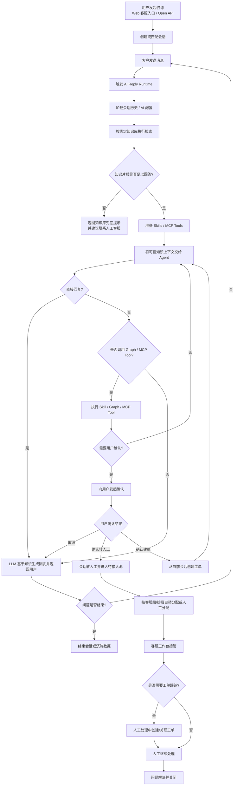
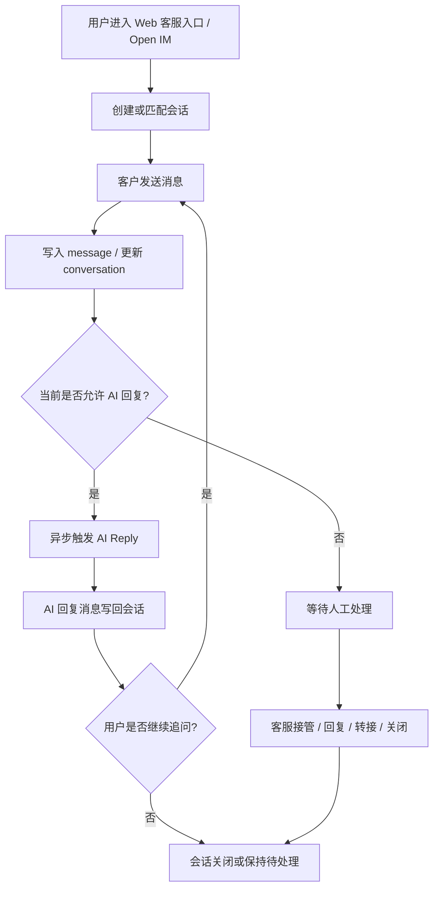
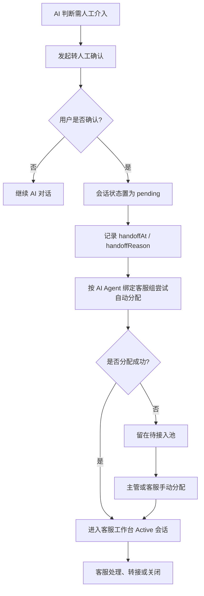
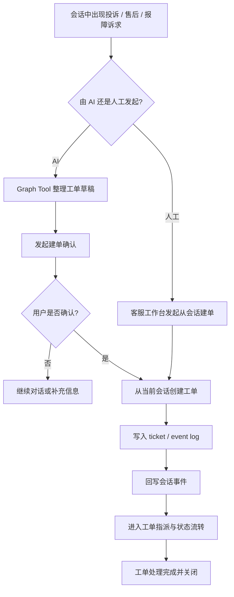
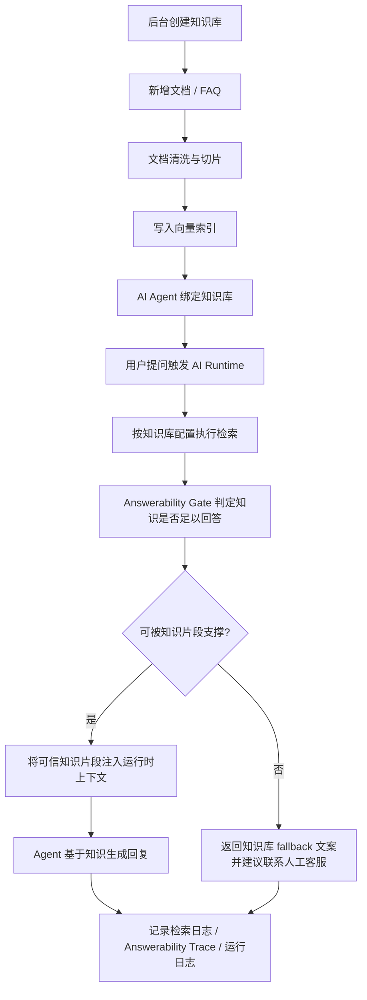
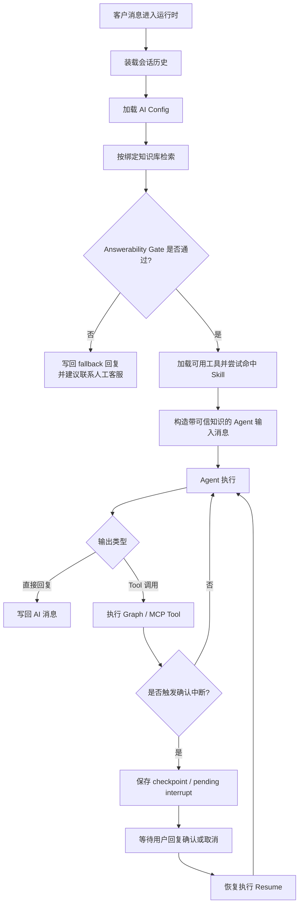

# 贝壳AI客服

> An AI-agent-first customer support system that unifies live chat, knowledge retrieval, ticketing, and seamless human handoff.

`贝壳AI客服`是一个以 **AI Agent 为核心** 的智能客服系统，面向需要同时处理在线咨询、知识库问答、人工接管和工单流转的团队。

它不是一个简单的聊天机器人，而是一套围绕客服场景设计的完整系统：

- AI Agent 先接待，优先处理常见问题与标准流程
- 知识库检索驱动回答，并通过 Answerability Gate 防止超出知识库范围时乱答
- 知识库无法支撑回答时返回兜底提示，并建议用户联系人工客服
- 后台可管理会话、工单、客服组、知识库、AI 配置、Skills 和 MCP
- 提供管理后台、客服工作台与客户侧 Web 接入入口

## 核心能力

- AI-first 客服流程：AI Agent 优先接待，支持自动回复、兜底与人工协同
- 在线会话系统：支持访客会话、会话分配、转接、关闭、未读状态与实时消息
- 知识库 RAG：支持知识库、文档、切片、检索日志与检索质量分析
- 工单系统：支持会话转工单、工单分类、状态流转与处理闭环
- 客服组织管理：支持客服档案、客服组、排班与分配能力
- AI 扩展能力：支持 Skills、MCP 调试与外部能力接入
- 统一前端工程：管理后台、客服工作台、客户侧 Web 接入页与嵌入式 SDK 统一放在 `web` 目录

## AI Agent 工作流程



## 核心业务流程

### 1. 会话处理流程



### 2. 人工接管与分配流程



### 3. 会话转工单流程



### 4. 知识库处理流程



### 5. AI Reply Runtime 流程



## 适用场景

- 官网在线客服
- SaaS 产品支持
- AI + 人工混合接待
- 企业内部服务台或运营支持台
- 需要知识库问答与人工协同的客服团队

## 技术栈

- Backend: Golang
- Frontend: Next.js 16 + React 19 + shadcn/ui + Tailwind CSS
- Database: SQLite / MySQL
- Vector DB: Qdrant
- AI: OpenAI-compatible LLM / Embedding + RAG + SKILLS + MCP

## 项目结构

```text
.
├── cmd/                    # server / migration / generator
├── internal/
│   ├── controllers/        # API controllers
│   ├── services/           # business services
│   ├── repositories/       # data access
│   ├── models/             # GORM models
│   ├── migration/          # data migrations
│   └── ai/                 # LLM / RAG / MCP related logic
├── web/                    # unified Next.js frontend
│   ├── app/dashboard/      # admin dashboard
│   ├── app/kefu/           # customer service entry and chat pages
│   ├── components/         # React components
│   ├── lib/                # API client, SDK source and utilities
│   ├── public/sdk/         # built embeddable SDK assets
│   └── scripts/            # frontend build scripts
├── config/                 # config files
└── docs/                   # project docs
```

## 快速开始

### 1. 环境要求

- Go `1.26+`
- Node.js `20+`
- `pnpm`
- Qdrant

### 2. 准备配置

复制示例配置：

```bash
cp config/config.example.yaml config/config.yaml
```

默认配置使用：

- SQLite：`data/app.db`
- Backend：`http://127.0.0.1:8083`
- Qdrant gRPC：`127.0.0.1:6334`

### 3. 启动 Qdrant

如果你本地还没有 Qdrant，可以用 Docker 快速启动：

```bash
docker run -p 6333:6333 -p 6334:6334 qdrant/qdrant
```

### 4. 安装前端依赖

```bash
cd web
pnpm install
cd ..
```

### 5. 启动项目

同时启动后端和前端：

```bash
make dev
```

或分别启动：

```bash
make run-go
make web-dev
```

开发环境默认入口：

- 管理后台：`http://localhost:3000/dashboard`
- 客服工作台：`http://localhost:3000/dashboard/conversations`
- 客户侧 Web 接入示例：`http://localhost:3000/kefu`
- 客户侧聊天页：`http://localhost:3000/kefu/chat`

生产构建时，前端统一由 `web` 工程构建，静态产物输出到 `web/out`，后端会从 `web/out` 提供静态资源。

## 常用命令

```bash
make dev            # 同时启动后端和前端开发服务
make run            # 构建前端 SPA 后启动后端
make run-go         # 启动后端，自动确保 SPA 已构建
make web-dev        # 启动前端开发服务
make build          # 构建前端 SPA 和当前平台 Go 二进制
make build-linux    # 构建 linux/amd64 二进制
make release        # 构建常用平台二进制
make web-build-spa  # 构建 web 静态 SPA 和嵌入式 SDK
make test           # 运行 Go 测试，自动确保 SPA 已构建
make check          # 运行 Go 测试、前端 typecheck 和 lint
make generator      # 执行代码生成
make enums          # 生成前端枚举
make migration      # 执行 migration
```

## Docker

推荐使用 Docker Compose 同时启动应用、MySQL 和 Qdrant：

```bash
docker compose up -d --build
```

Compose 默认会启动：

- `cs-agent`：应用服务，端口 `8083`
- `mysql`：MySQL 8.4，数据卷 `mysql-data`
- `qdrant`：向量数据库，数据卷 `qdrant-data`，端口 `6333`/`6334`

Compose 使用 [docker/cs-agent.yaml](docker/cs-agent.yaml) 作为容器内配置，应用会通过 Docker 内部服务名访问 `mysql` 和 `qdrant`。

也可以只构建应用镜像，但需要自行准备 MySQL 和 Qdrant，并挂载对应配置：

```bash
docker build -t cs-agent .
docker run --rm -p 8083:8083 \
  -v $(pwd)/docker/cs-agent.yaml:/app/config/config.yaml:ro \
  -v cs-agent-data:/app/data \
  cs-agent
```

## 系统视角

- 管理后台：负责 AI Agent、知识库、客服组、工单与运营配置
- 客服工作台：负责接管会话、处理消息与人工服务
- 客户侧 Web 接入：通过 `/kefu`、`/kefu/chat` 和 `web/public/sdk` 中的嵌入式脚本承接用户咨询入口

这使得`贝壳AI客服`可以同时覆盖：

- AI 接待
- 人工协同
- 知识驱动回答
- 工单追踪闭环

## 开源定位

`贝壳AI客服`适合作为以下方向的开源基础项目：

- AI 客服系统
- AI Helpdesk / AI Support Platform
- RAG 可回答性判定 + Human Handoff 的落地样板
- 面向企业场景的 AI Agent 应用框架

如果你在寻找一个 **以 AI Agent 为中心，而不是仅仅把 LLM 嵌进聊天框** 的客服系统，这个项目就是为此设计的。
