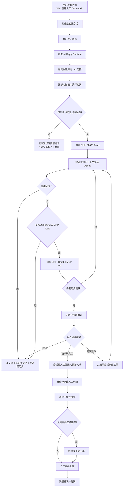
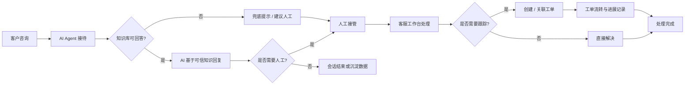

# AgentDesk

[English](README.md) | 简体中文

开源的 AI Agent 客服系统，支持知识库问答、人工接管、工单闭环和私有化部署。

> 面向需要同时处理在线咨询、知识库问答、人工协同和服务跟踪的团队。它不是把 LLM 接进聊天框，而是一套围绕客服场景设计的 AI Helpdesk 基础系统。

## 产品预览

客户侧在线咨询、客服工作台、知识库、模型配置和 AI Agent 编排都在同一套系统中完成。

### 客户侧在线咨询


客户可以在 Web 聊天页中直接发起咨询。AI Agent 会先接待，基于知识库回答问题；当用户明确要求人工介入时，会触发转人工确认流程。

### 客服工作台


客服工作台支持会话列表、消息处理、AI 转人工、客服回复、会话标签、关联客户和工单信息查看，适合客服日常接待使用。

### 知识库与 AI 配置

| 知识库 FAQ | AI Agent 配置 |
| --- | --- |
|  |  |

知识库用于沉淀 FAQ、文档和可检索内容；AI Agent 可以绑定模型配置、知识库、Skills 和工具能力，形成面向具体客服场景的智能客服实例。

### 模型配置


模型配置支持 OpenAI-compatible 接入方式，可分别配置大语言模型、向量模型和重排模型，并管理上下文、输出、超时、重试和启用状态。

## 为什么选择它

- **AI 先接待**：让 AI Agent 优先处理常见问题、标准流程和知识库问答。
- **知识约束回答**：通过 RAG 和 Answerability Gate 判断知识片段是否足以回答，减少超出知识库范围的乱答。
- **自然转人工**：当知识库不足、用户明确要求或流程需要人工确认时，进入人工接管。
- **会话到工单闭环**：在线会话、客服接待、工单创建、状态流转和处理记录在同一套系统里完成。
- **适合二次开发**：后端使用 Go，前端使用 Next.js，支持 Skills、MCP 和 OpenAI-compatible 模型接入。
- **可私有化部署**：支持 SQLite / MySQL 和 Qdrant，适合本地体验、内网部署和企业自托管。

## 核心能力

- **AI Agent 客服**：AI 优先回复，支持兜底、确认、工具调用和人工协同。
- **在线会话系统**：支持访客会话、消息收发、未读状态、会话分配、转接和关闭。
- **客服工作台**：客服可接管会话、回复用户、转接同事、关联客户和创建工单。
- **知识库 RAG**：支持知识库、文档、FAQ、切片、向量检索、检索日志和质量分析。
- **Answerability Gate**：判断检索内容是否足以支撑回答，不足时返回兜底提示并建议联系人工。
- **工单系统**：支持从会话创建工单、分类、指派、状态流转、进展记录和闭环处理。
- **客服组织管理**：支持客服档案、客服组、排班和自动分配能力。
- **AI 扩展能力**：支持 Skills、MCP 调试和外部工具接入。
- **多入口接入**：提供管理后台、客服工作台、客户侧 Web 页面和嵌入式 SDK。

## 适用场景

- 官网在线客服
- SaaS 产品支持
- AI + 人工混合接待
- 企业内部服务台
- 售后、报障、投诉和运营支持
- 需要知识库问答与人工协同的客服团队

## 快速开始

推荐先用 Docker Compose 体验完整服务：

```bash
docker compose up -d --build
```

完整英文配置与排查说明见 [Docker Compose Quick Start](https://agent-desk.huabei.pro/zh/docs/getting-started/docker-compose.html)。

如需在官网或产品中嵌入客服入口，见 [Web Widget Integration](https://agent-desk.huabei.pro/zh/docs/integration/web-widget.html)。

如需接入 OpenAI-compatible 模型供应商，见 [Model Provider Configuration](https://agent-desk.huabei.pro/zh/docs/config/model-provider.html)。

Compose 默认会启动：

- `agent-desk`：应用服务，端口 `8083`
- `mysql`：MySQL 8.4，数据卷 `mysql-data`
- `qdrant`：向量数据库，数据卷 `qdrant-data`，端口 `6333` / `6334`

启动后访问：

- 管理后台：`http://localhost:8083/dashboard`
- 客服工作台：`http://localhost:8083/dashboard/conversations`
- 客户侧 Web 接入示例：`http://localhost:8083/support/demo`
- 客户侧聊天页：`http://localhost:8083/support/chat`

默认管理员账号：

- 用户名：`admin`
- 密码：`ChangeMe123!`

> 首次用于公网或团队环境前，请务必修改默认管理员密码，并配置独立的鉴权、会话和模型密钥。

## 本地开发

### 环境要求

- Go `1.26+`
- Node.js `20+`
- `pnpm`
- Qdrant

### 准备配置

```bash
cp config/config.example.yaml config/config.yaml
```

默认配置使用：

- SQLite：`data/app.db`
- Backend：`http://127.0.0.1:8083`
- Qdrant gRPC：`127.0.0.1:6334`

如果本地还没有 Qdrant，可以用 Docker 启动：

```bash
docker run -p 6333:6333 -p 6334:6334 qdrant/qdrant
```

安装前端依赖：

```bash
cd web
pnpm install
cd ..
```

同时启动后端和前端开发服务：

```bash
make dev
```

或分别启动：

```bash
make run-go
make web-dev
```

开发环境默认入口：

- 管理后台：`http://localhost:3000/dashboard`
- 客服工作台：`http://localhost:3000/dashboard/conversations`
- 客户侧 Web 接入示例：`http://localhost:3000/support/demo`
- 客户侧聊天页：`http://localhost:3000/support/chat`

## 技术栈

- Backend：Golang + Gin + GORM + `github.com/mlogclub/simple`
- Frontend：Next.js 16 + React 19 + shadcn/ui + Tailwind CSS
- Database：SQLite / MySQL
- Vector DB：Qdrant
- AI：OpenAI-compatible LLM / Embedding + RAG + Skills + MCP

## 项目结构

```text
.
├── cmd/                    # server / migration / generator / testdata
├── internal/
│   ├── bootstrap/          # 启动、路由、数据库和迁移初始化
│   ├── builders/           # model / 聚合结果到 response DTO 的映射
│   ├── handlers/           # dashboard / api / third HTTP handlers
│   ├── middleware/         # Gin middleware
│   ├── migration/          # 幂等数据迁移
│   ├── models/             # GORM models
│   ├── repositories/       # 数据访问层
│   ├── services/           # 业务编排和事务边界
│   ├── ai/                 # LLM / RAG / Runtime / Skills / MCP
│   └── pkg/                # config / dto / enums / httpx / utils 等基础包
├── web/                    # Next.js 前端工程
│   ├── app/dashboard/      # 管理后台与客服工作台
│   ├── app/support/        # 客户侧接入和聊天页面
│   ├── components/         # React 组件
│   ├── lib/                # API client、SDK 源码和工具函数
│   └── public/sdk/         # 构建后的嵌入式 SDK
├── config/                 # 配置文件
├── docker/                 # Docker 配置
└── docs/                   # 项目文档
```

## 常用命令

```bash
make dev            # 同时启动后端和前端开发服务
make run            # 构建前端 SPA 后启动后端
make run-go         # 启动后端，自动确保 SPA 已构建
make web-dev        # 启动前端开发服务
make build          # 构建前端 SPA 和当前平台 Go 二进制
make build-linux    # 构建 linux/amd64 二进制
make release        # 构建常用平台二进制
make web-build-spa  # 构建 web 静态 SPA 和嵌入式 SDK
make test           # 运行 Go 测试，自动确保 SPA 已构建
make check          # 运行 Go 测试、前端 typecheck 和 lint
make generator      # 执行代码生成
make enums          # 生成前端枚举
make migration      # 执行 migration
make testdata       # 初始化演示/测试数据
```

## AI Agent 工作流



## 业务闭环



## Docker 镜像

如果只需要构建应用镜像，可以自行准备 MySQL 和 Qdrant，并挂载配置文件：

```bash
docker build -t mlogclub/agent-desk .
docker run --rm -p 8083:8083 \
  -v $(pwd)/docker/agent-desk.yaml:/app/config/config.yaml:ro \
  -v agent-desk-data:/app/data \
  mlogclub/agent-desk
```

Compose 使用 [docker/agent-desk.yaml](docker/agent-desk.yaml) 作为容器内配置，应用会通过 Docker 内部服务名访问 `mysql` 和 `qdrant`。

## 开源定位

`AgentDesk` 适合作为以下方向的开源基础项目：

- AI 客服系统
- AI Helpdesk / AI Support Platform
- RAG 可回答性判定 + Human Handoff 的落地样板
- 面向企业场景的 AI Agent 应用框架

如果你在寻找一个以 AI Agent 为中心，而不是仅仅把 LLM 嵌进聊天框的客服系统，这个项目就是为此设计的。
